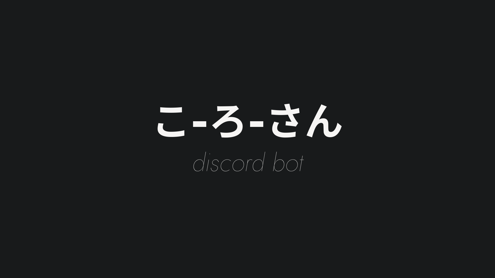

[](https://github.com/ArthurSegato/korosan/actions/workflows/workflow.yml)

Korosan is a discord bot created to add extra features to my private server, such as check if my applications/servers/API's are online, calculate response times and etc...

## Getting Started

These instructions will give you a copy of the project up and running on your local machine for development and testing purposes. See deployment for notes on deploying the project on a live system.

### Prerequisites

Requirements for the software and other tools to build, test and push.

- [Bun v1.1.21](https://bun.sh/) or above

Environment variables required to run this project:

```Properties
DISCORD_TOKEN=""
CLIENT_ID=""
GUILD_ID=""
```

### Setup

Make sure to install the dependencies:

```bash
# npm
npm install

# pnpm
pnpm install

# yarn
yarn install

# bun
bun install
```

### Development

Start the bot without registering slash commands:

```bash
# npm
npm run dev

# pnpm
pnpm run dev

# yarn
yarn dev

# bun
bun dev
```

### Production

Start the bot and register slash commands:

```bash
# npm
npm run start

# pnpm
pnpm run start

# yarn
yarn start

# bun
bun start
```

## Deployment

This project is automatically deployed on my vps through github actions.

## Contributing

Please read [CONTRIBUTING.md](CONTRIBUTING.md) for details on our code of conduct, and the process for submitting pull requests to us.

## Authors

- **Arthur Segato** - Created the bot - [seh-GAH-toh](https://github.com/seh-GAH-toh)

See also the list of [contributors](https://github.com/seh-GAH-toh/EndPoem) who participated in this project.

## License

This project is licensed under the [MIT](LICENSE) License - see the [LICENSE.md](LICENSE) file for details.
